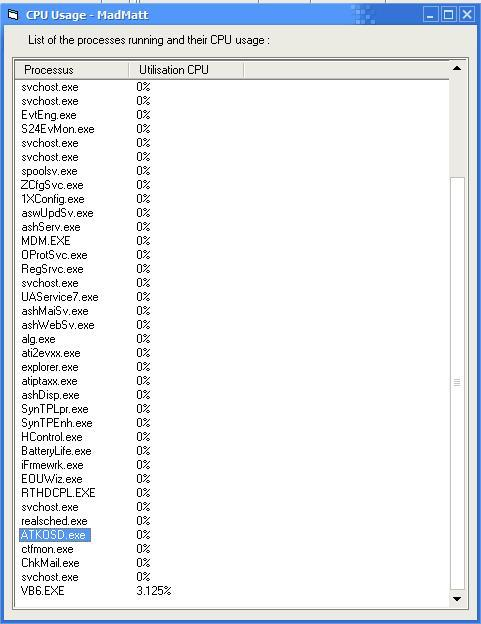



## CPU usage of one process

### Description

Hello everybody,

this is my first source code here, i hope you will enjoy it ;-)

This source code list the processes running on you're computer and list their individual CPU usage.

I mean that for each process, you get his % of processor time, exactly like in the windows task manager.
 
### More Info
 
This code uses the PDH.dll library and the performance counters, the cpu usage is not the only information you can get with my code, but i took this exemple because this is a frequently asked question in forums and it may interest some people.

I hope you'll find this helpfull.

MadMatt

Matthieu Napoli

             |
---                |---
**Submitted On**   |2006-08-11 02:25:04
**By**             |[MadMatt](https://github.com/Planet-Source-Code/PSCIndex/blob/master/ByAuthor/madmatt.md)
**Level**          |Intermediate
**User Rating**    |4.8 (24 globes from 5 users)
**Compatibility**  |VB 3\.0, VB 4\.0 \(16\-bit\), VB 4\.0 \(32\-bit\), VB 5\.0, VB 6\.0
**Category**       |[Windows API Call/ Explanation](https://github.com/Planet-Source-Code/PSCIndex/blob/master/ByCategory/windows-api-call-explanation__1-39.md)
**World**          |[Visual Basic](https://github.com/Planet-Source-Code/PSCIndex/blob/master/ByWorld/visual-basic.md)
**Archive File**   |[CPU\_usage\_2012588102006\.zip](https://github.com/Planet-Source-Code/madmatt-cpu-usage-of-one-process__1-66243/archive/master.zip)

